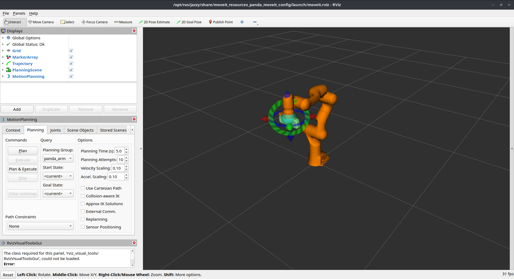
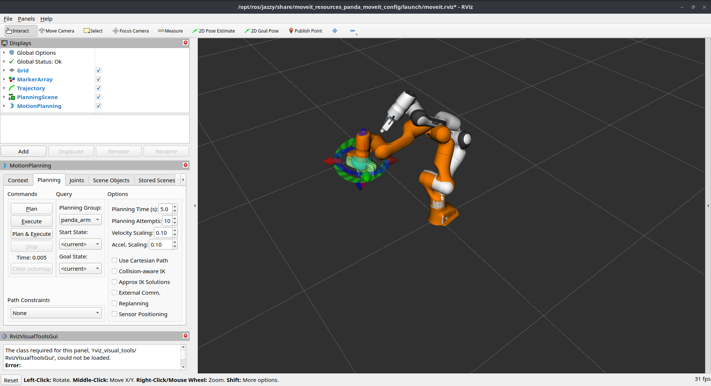
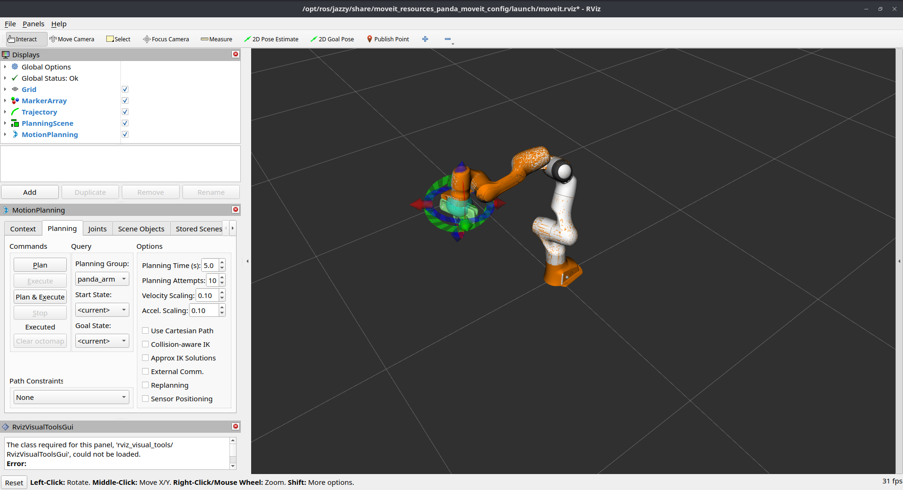
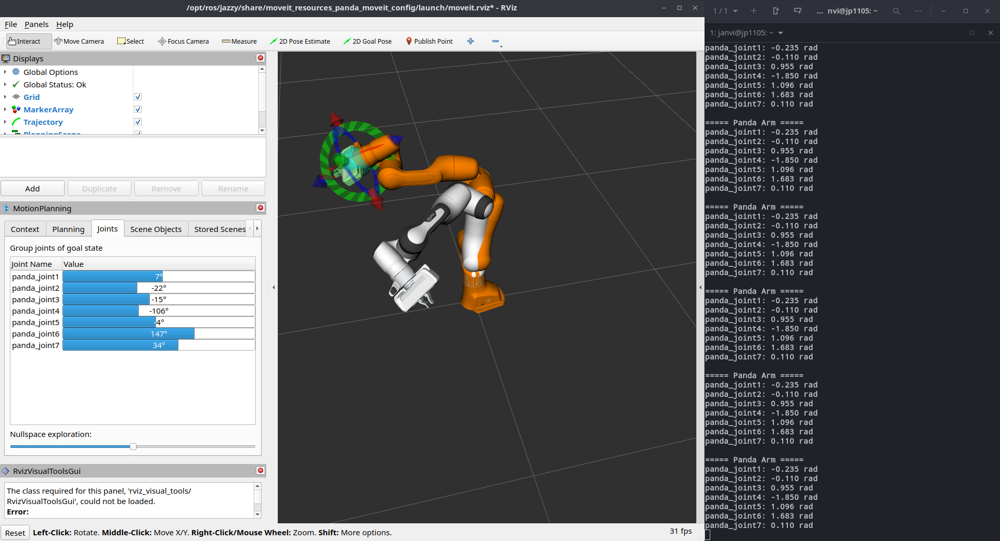
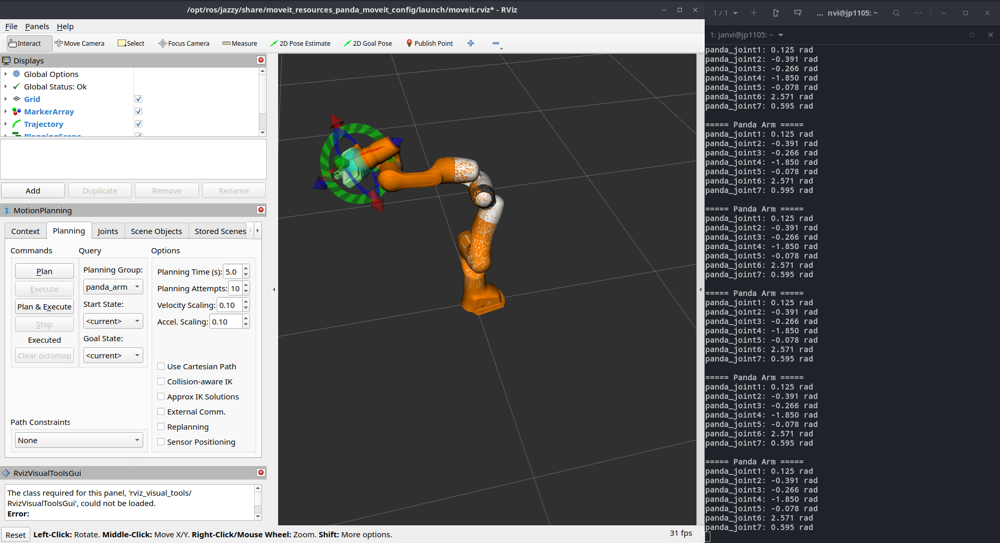

# Robotic Arm Motion Planning using ROS2 and MoveIt2

This project was developed to understand robotic arm motion planning, robot kinematics, and ROS2-based robotic software development using the Franka Emika Panda robot.

## Technologies Used

* ROS2 Jazzy
* MoveIt2
* RViz2
* Python
* TF2

## Features

* Joint State Monitoring
* End-Effector Pose Monitoring
* Forward Kinematics (FK)
* Inverse Kinematics (IK)
* Motion Planning and Execution

## ROS2 Nodes Developed

### hello_node.py

Basic ROS2 node for package verification.

### joint_reader.py

Reads robot joint states from `/joint_states`.

### joint_monitor.py

Displays Panda robot joint angles in real time.

### fk_monitor.py

Monitors the end-effector pose using TF2 transforms.

## Key Concepts Explored

* ROS2 Nodes and Topics
* TF2 Transformations
* Forward Kinematics
* Inverse Kinematics
* MoveIt2 Motion Planning
* Robot State Monitoring

## Challenges Faced

Motion planning initially failed because robot joint states were not being published. The issue was resolved by installing and configuring the required ROS2 control packages and activating the `joint_state_broadcaster`.

## Conclusion

This project provided hands-on experience with ROS2, MoveIt2, TF2, robot kinematics, and motion planning while developing practical debugging and robotic software development skills.

## Project Demonstration

### Panda Robot Loaded in RViz

The Franka Emika Panda robot was successfully loaded in RViz using MoveIt2 for motion planning and trajectory execution.

### Motion Planning using MoveIt2

A target pose was provided through RViz and MoveIt2 generated a valid collision-free trajectory for the robot arm.

### Joint State Monitoring

A custom ROS2 Python node was developed to subscribe to the `/joint_states` topic and monitor the robot's joint angles in real time.

